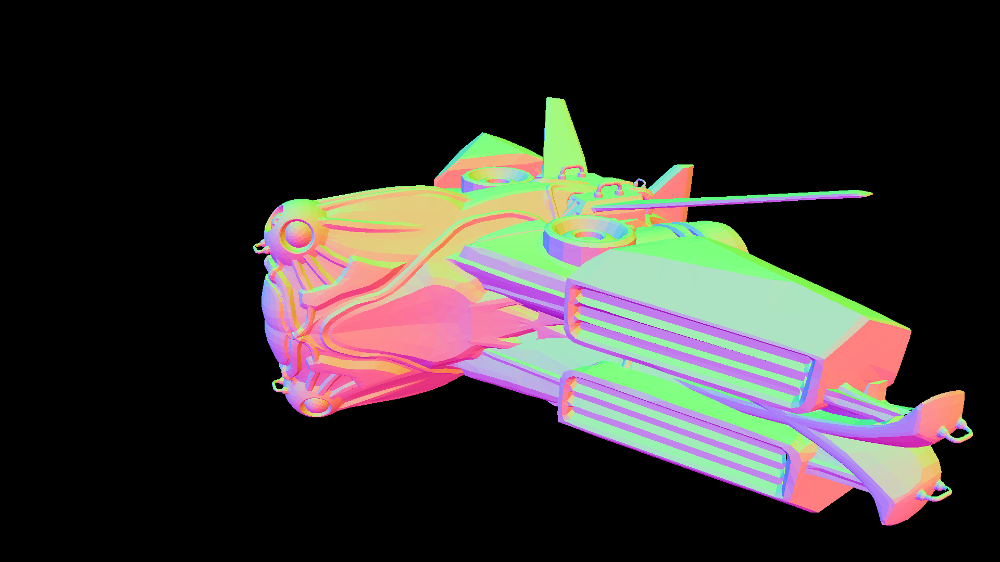

# Computer Graphics, 2020

This repository contains projects from computer graphics course, some rendered images are listed below:

- "Spaceship", rendered with [a rasterizer](./pa1):
  
- "Car", rendered with [a Monte Carlo path tracer](./pa2):
  

> Author: Blurgy <gy@blurgy.xyz>
> Date:   Mar 27 2021, 15:21 [CST]
