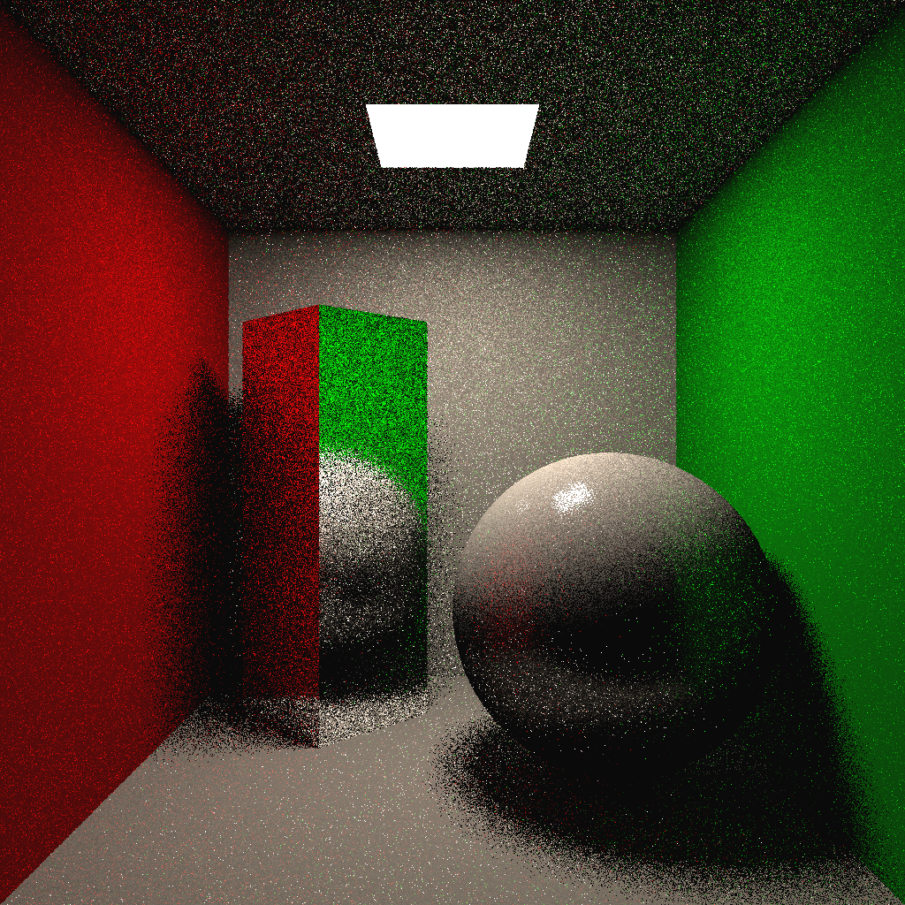
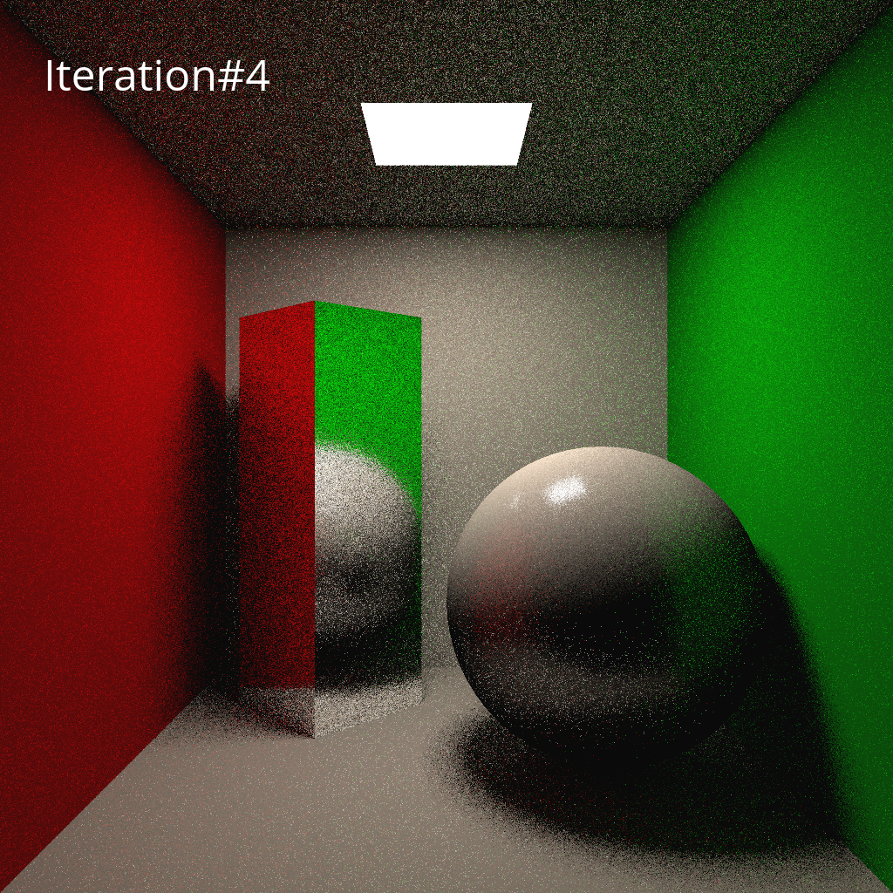
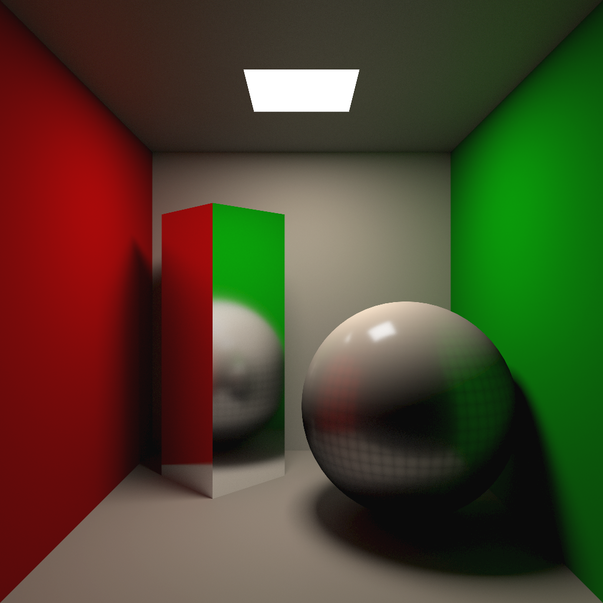
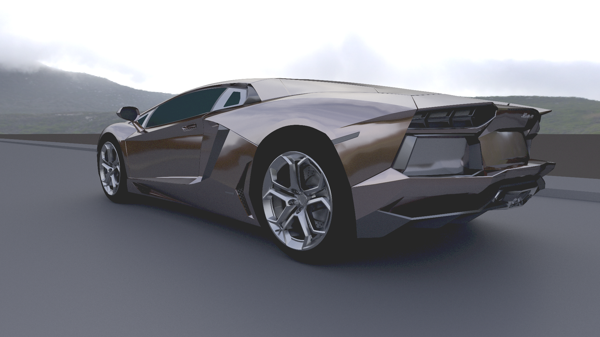
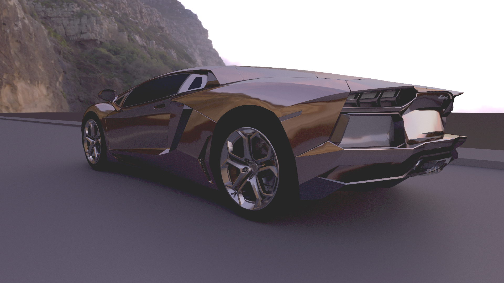
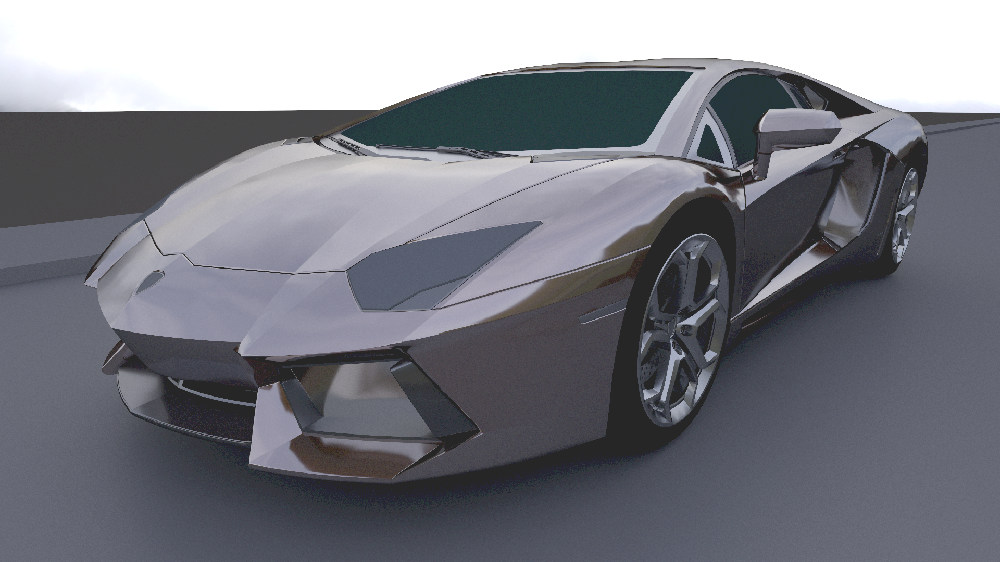
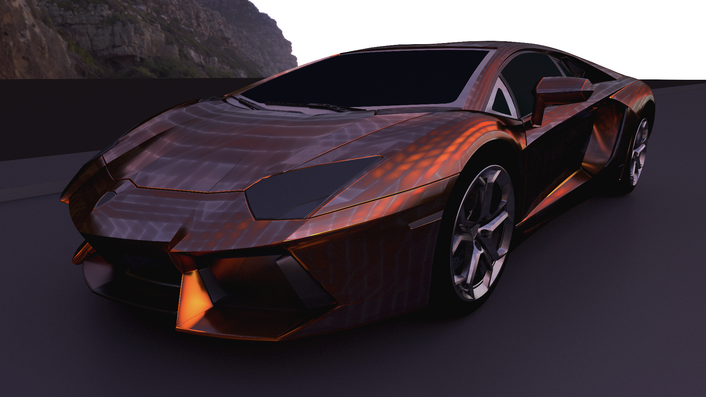
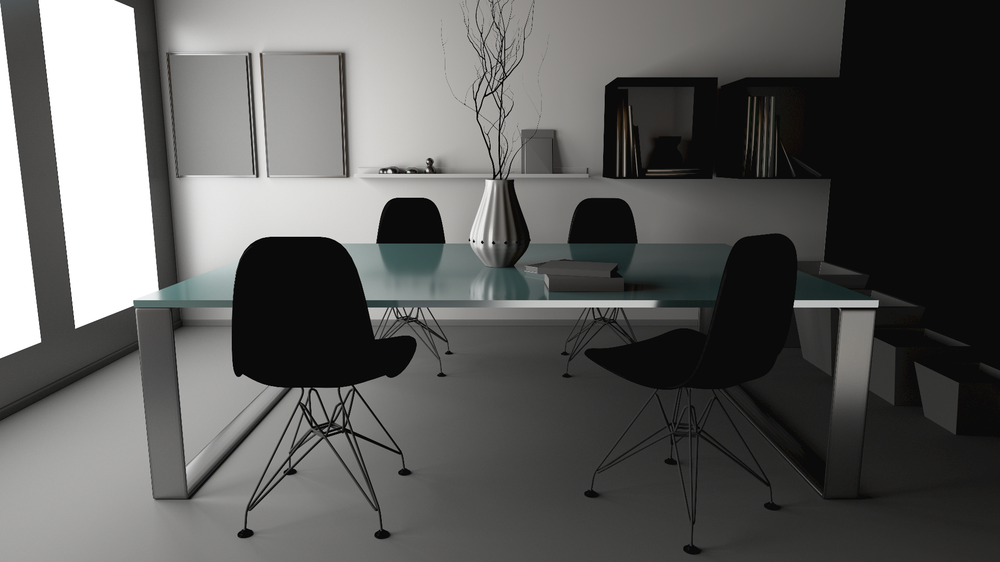
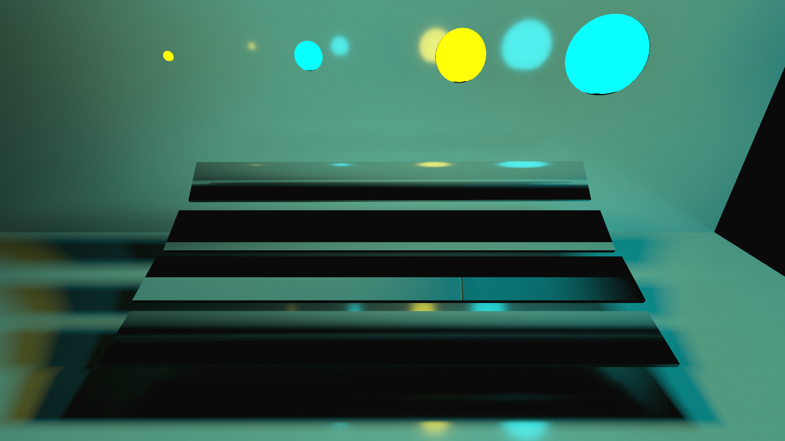

# Assignment 2

## 测试环境

- Arch Linux (linux-zen 5.11.8)
- CMake (3.20.0)
- g++ (10.2.0)
- Magick++ (7.0.11.4)

## 文件结构

使用的外部库有 [`glm`](./exter/glm), [`tinyobjloader`](./extern/tinyobjloader) 和 [`Magick++`]().  [include](./include) 文件夹下是蒙特卡洛路径追踪的相关功能和数据结构等的实现, [`main.cpp`](./main.cpp) 是主函数所在的文件, [`CMakeLists.txt`](./CMakeLists.txt) 和 [`Makefile`](./Makefile) 是用于构建项目的工程文件.  文件夹 [`cameras`](./cameras) 下的文件是所给场景的相机参数.

## 使用方法

首先安装[依赖](#测试环境).

### 编译

进入文件夹后执行

```shell
$ make
```

或

```shell
$ cmake -S . -B build && make -C build
```

编译得到的二进制可执行文件为 `build/pbr`.

### 运行

直接不带参数执行 `build/pbr`, 将输出使用方法.  下面是使用实例:

```shell
$ ./build/pbr cornellbox.obj -c cameras/cornellbox
```

其中 `cornellbox.obj` 是模型文件路径, `cameras/cornellbox` 是相机参数, 使用 `-c` 传递.  相机参数文件内容示例:

    # Cornell box
    position    0 0 2.5
    lookat      0 0 0
    up          0 1 0
    fov         60

### 参数

直接执行 `./build/pbr` 而不提供参数, 程序将输出可选参数并退出.

- `-c|--config <camera.conf>` 指定相机参数文件, 文件内容示例见[此处](./cameras/cornellbox)
- `-k|--skybox <skyboximagefile>` 指定 Sky Box 图像文件, 默认为黑色 Sky Box.
- `-r|--resolution <width>x<height>` 指定输出图像分辨率, 默认为 `1920x1080`.
- `-g|--gamma <gamma>` 指定写图像时使用的伽玛矫正指数, 默认为 `0.5`.
- `-i|--iterations <iterations>` 指定多少次迭代后结束, 默认为 `8` 次.
- `-rr <probability>` 指定路径追踪过程中, 每次在表面反射的概率, 默认为 `0.85`.

示例:

```shell
$ ./build/pbr car.obj \
              -c cameras/car-front \
              -k environment_day.hdr \
              -g 0.3 \
              -i 32 \
              -rr 0.6
```

将读取 `cameras/car-front` 内的相机配置, 以图像 `environment_day.hdr` 作为 SkyBox, 输出时的伽玛矫正指数使用 `0.3`, 经过 `32` 次迭代后结束, 每次在表面反射的概率为 `0.6`.

## 说明

有两种等效的方式可以降低最终输出图像中的噪声:

1. 在一次绘制中, 对每一个像素做多次采样, 绘制一次, 对所有采样取平均;
2. 在一次绘制中, 对每一个像素做一次采样, 绘制多次, 对所有绘制结果取平均.

我使用了第二种方式, 即迭代 `n` 次 `spp=1` 的绘制, 最后对所有绘制图像求平均图像作为输出.  这样的好处是能够迅速看到结果, 也可以随时结束绘制并保留当前结果.  下面是 Cornell Box 模型在不同迭代次数下的对比:

|迭代次数|1|4|16|256|
|:---:|:---:|:---:|:---:|:---:|
||||||

## 结果

- Cornell Box
  
- Car
    |viewpoint \ skybox| day | dusk |
    |:---:|:---:|:---:|
    |back|||
    |front|||
- Dining Room
  
- 其他结果
  

> Author: Blurgy <gy@blurgy.xyz>
> Date:   Mar 26 2021, 12:24 [CST]
